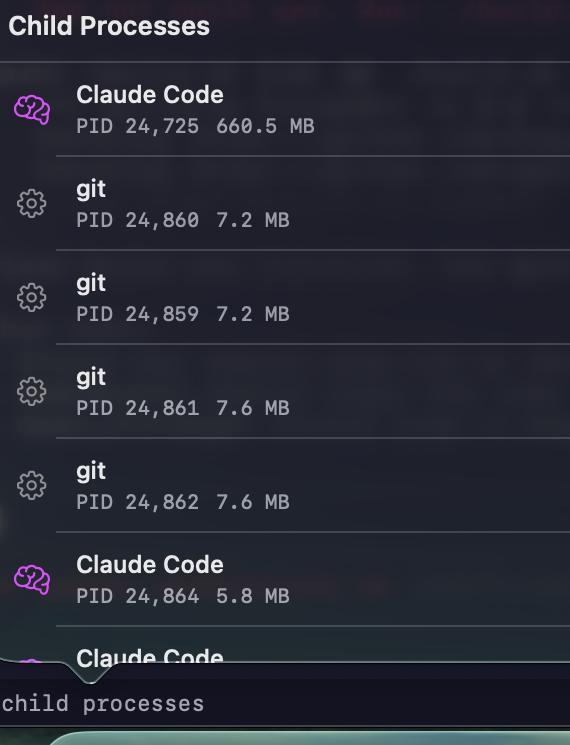
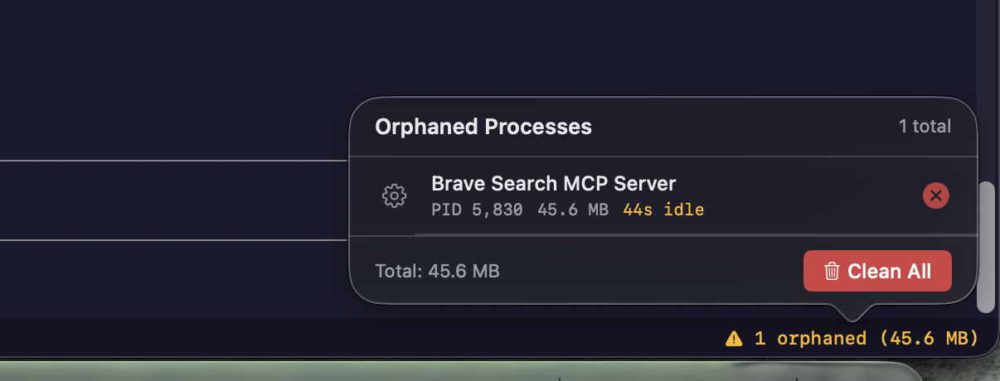

# ClaudyBro

A lightweight, purpose-built macOS terminal for [Claude Code](https://docs.anthropic.com/en/docs/claude-code). Native Swift app with smart process management, image paste support, and a fraction of the footprint of general-purpose terminals.

  

## Performance

Benchmarked on Apple Silicon (idle shell, no Claude running):

| Metric | ClaudyBro | Ghostty | Warp |
|--------|-----------|---------|------|
| **Memory (RSS)** | 68.5 MB | 80.9 MB | ~250 MB |
| **CPU (idle)** | 0.0% | 0.0% | ~5% |
| **Disk size** | 3.5 MB | 62 MB | 326 MB |
| **Startup** | < 0.5s | ~ 0.5s | ~2s |

With Claude Code running (idle, waiting for input):

| Metric | ClaudyBro | Ghostty | Warp |
|--------|-----------|---------|------|
| **Memory (RSS)** | 81.9 MB | 139.8 MB | ~300 MB |
| **CPU (idle)** | 0.0% | 0.0% | ~5% |

ClaudyBro is **18x smaller than Ghostty** and **93x smaller than Warp** on disk, and uses **41% less memory** than Ghostty with Claude running.

## Why ClaudyBro?

Standard terminals work fine with Claude Code, but have friction points that add up:

- **Image paste** — Claude Code can't receive images from the clipboard in most terminals. ClaudyBro intercepts Cmd+V, detects image data, saves it to a temp file, and injects the path into your prompt. Just copy a screenshot and paste.

- **Process inspector** — Click the child process count in the status bar to see every process Claude has spawned — name, PID, memory usage, and whether it's an MCP server. No more guessing what's running.

  

- **Orphaned process cleanup** — Node processes that outlive their parent tool call are detected as orphans after 30s of idle time. Kill them individually or in bulk from the orphan detail panel.

  

- **Smart MCP cleanup** — Duplicate MCP servers are automatically killed (keeps the newest instance). When Claude exits, all remaining MCP servers are terminated automatically — no more leftover node processes eating memory.

- **MCP-aware monitoring** — ClaudyBro identifies MCP servers (Shadcn, Brave Search, Playwright, Context7) by inspecting their command-line args via `KERN_PROCARGS2`. These are tagged with an "MCP" badge in the process inspector and excluded from false-positive orphan alerts.

- **Lightweight by design** — No Electron, no web views, no bundled runtime. Pure Swift + SwiftTerm with aggressive memory tuning: 100-line scrollback, 1MB image cache (vs SwiftTerm's 320MB default), sixel disabled.

## Features

| Feature | Details |
|---------|---------|
| **Terminal engine** | [SwiftTerm](https://github.com/migueldeicaza/SwiftTerm) (LocalProcessTerminalView) |
| **Image paste** | Cmd+V detects clipboard images, saves to `/tmp/claudybro/`, injects path |
| **File drop** | Drag PNG/JPG/PDF/SVG onto the terminal to inject file paths |
| **Tabs** | Cmd+T new tab, Cmd+W close, Cmd+Shift+]/[ switch |
| **Process inspector** | Click child process count to see all processes with PID, memory, and MCP badges |
| **Orphan panel** | Click the status bar warning to see each orphan's description, PID, memory, idle time |
| **Process monitor** | sysctl-based (no shell spawning), polls every 5s on a background thread |
| **Claude launcher** | Toolbar buttons for `claude` and `claude --dangerously-skip-permissions` |
| **Directory persistence** | Remembers your last working directory across app restarts |
| **Check for Updates** | Menu bar item checks GitHub Releases for new versions |
| **Theme** | Dark theme matching Claude Code's aesthetic |
| **Settings** | Font size, claude binary path, orphan timeout, auto-cleanup toggle |

## Keyboard Shortcuts

| Shortcut | Action |
|----------|--------|
| Cmd+V | Image-aware paste (falls through to text paste if no image) |
| Cmd+K | Clear terminal |
| Cmd+T | New tab |
| Cmd+W | Close tab |
| Cmd+Shift+] | Next tab |
| Cmd+Shift+[ | Previous tab |
| Cmd+Shift+K | Kill orphaned processes |
| Cmd+, | Settings |

## Install

### From DMG (recommended)

Download the latest `.dmg` from [Releases](https://github.com/PedramGhdi/ClaudyBro/releases), open it, and drag ClaudyBro to Applications.

### From source

Requires Xcode Command Line Tools and macOS 13.0+.

```bash
git clone https://github.com/PedramGhdi/ClaudyBro.git
cd ClaudyBro
./build.sh            # Build
./build.sh install    # Install to /Applications
```

### Homebrew (coming soon)

```bash
brew tap PedramGhdi/tap
brew install --cask claudybro
```

## Build Commands

```bash
./build.sh            # Build release .app bundle
./build.sh install    # Copy to /Applications
./build.sh dmg        # Create distributable DMG
./build.sh clean      # Remove build artifacts
```

## Architecture

```
ClaudyBro.app (3.4 MB)
├── SwiftUI Shell
│   ├── TabManager          — Multi-tab terminal sessions
│   ├── LaunchToolbar       — Claude CLI launcher buttons
│   └── StatusBar           — Process count + orphan alerts
├── SwiftTerm Bridge
│   └── ClaudyTerminalView  — Subclass with image paste, drag-drop, shortcuts
├── Services
│   ├── ProcessMonitor      — Child process tree tracking (sysctl, not ps)
│   ├── ImagePasteHandler   — NSPasteboard → temp PNG → path injection
│   └── UpdateChecker       — GitHub Releases version check
└── Utilities
    └── ProcessTreeQuery    — KERN_PROC_ALL, KERN_PROCARGS2, proc_pidinfo
```

## How Orphan Detection Works

1. On Claude start, ClaudyBro records the shell PID
2. Every 5 seconds (background thread), it queries all descendant processes via `sysctl`
3. For each `node` process, it samples CPU time via `proc_pidinfo(PROC_PIDTASKINFO)`
4. If CPU time hasn't changed for 2+ consecutive polls (~10s), the process is marked as an orphan candidate
5. Command-line args are inspected via `KERN_PROCARGS2` — processes containing "mcp", "language-server", or "tsserver" are excluded (legitimately idle)
6. After the configured timeout (default 30s), confirmed orphans appear in the status bar with a detail panel

## Configuration

Settings are stored at `~/.config/claudybro/config.json`:

```json
{
  "font": "SF Mono",
  "fontSize": 13,
  "claudePath": "auto",
  "theme": "dark",
  "autoCleanOrphans": false,
  "orphanTimeoutSeconds": 30,
  "processMonitorInterval": 5
}
```

## Requirements

- macOS 13.0 (Ventura) or later
- Apple Silicon or Intel Mac
- [Claude Code](https://docs.anthropic.com/en/docs/claude-code) CLI installed

## Tech Stack

- **Language**: Swift 5.9
- **UI**: SwiftUI + AppKit (NSViewRepresentable)
- **Terminal**: [SwiftTerm](https://github.com/migueldeicaza/SwiftTerm) 1.12.0
- **Process queries**: Darwin sysctl, proc_pidinfo (no shell exec)
- **Build**: Swift Package Manager + release optimizations (WMO, LTO)
- **Sandbox**: Disabled (required for subprocess access)

## License

MIT
