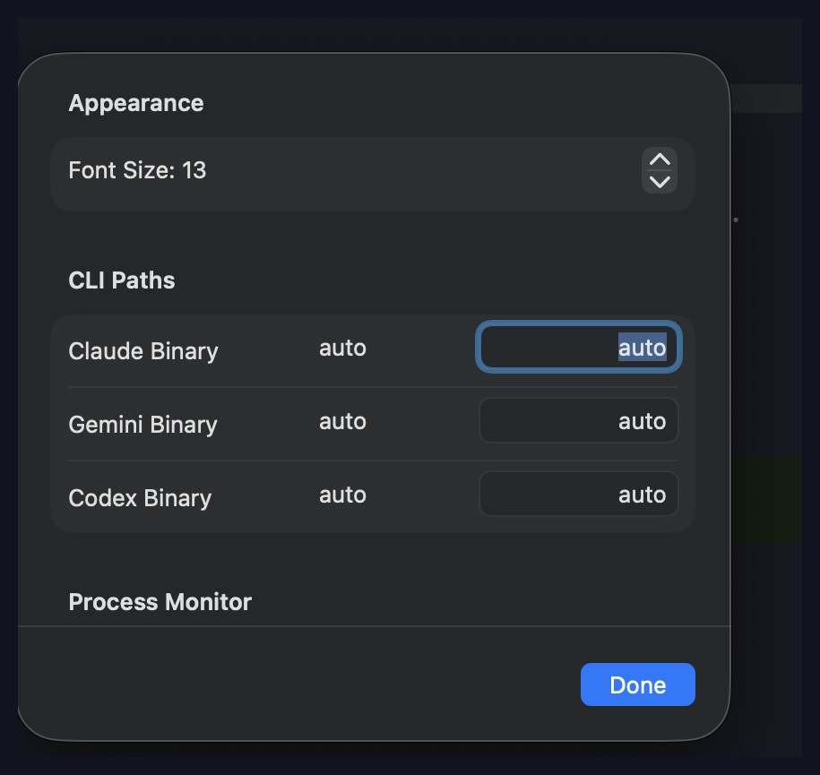
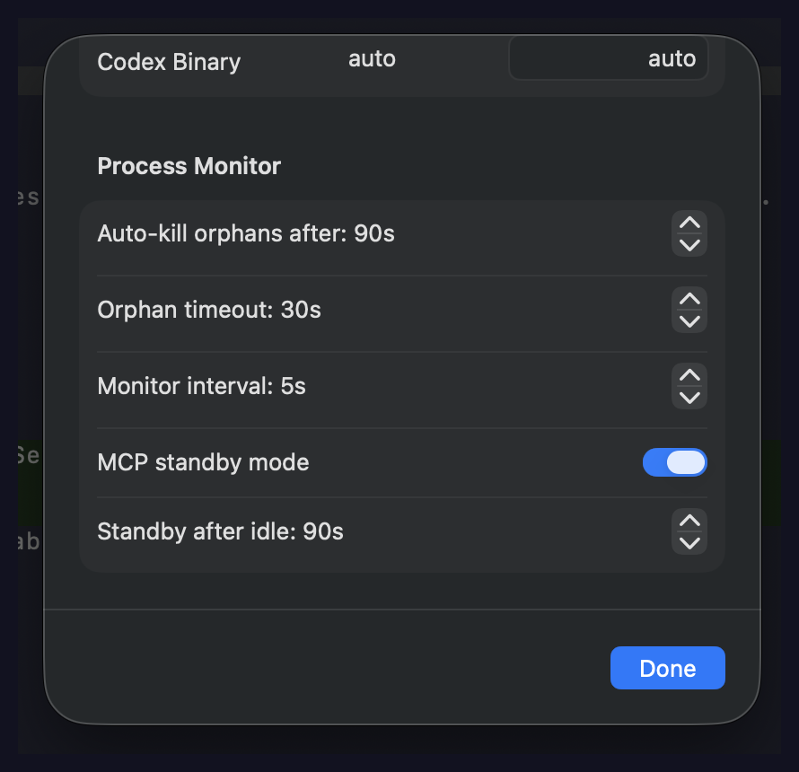

# ClaudyBro

A lightweight, purpose-built macOS terminal for AI coding CLIs — [Claude Code](https://docs.anthropic.com/en/docs/claude-code), [Gemini CLI](https://github.com/google-gemini/gemini-cli), and [OpenAI Codex CLI](https://github.com/openai/codex). Native Swift app with smart process management, image paste support, and a fraction of the footprint of general-purpose terminals.

  

## Performance

Benchmarked on Apple Silicon (idle shell, no Claude running):

| Metric | ClaudyBro | Ghostty | Warp |
|--------|-----------|---------|------|
| **Memory (RSS)** | 68.5 MB | 80.9 MB | ~250 MB |
| **CPU (idle)** | 0.0% | 0.0% | ~5% |
| **Disk size** | 3.9 MB | 62 MB | 326 MB |
| **Startup** | < 0.5s | ~ 0.5s | ~2s |

With Claude Code running (idle, waiting for input):

| Metric | ClaudyBro | Ghostty | Warp |
|--------|-----------|---------|------|
| **Memory (RSS)** | 81.9 MB | 139.8 MB | ~300 MB |
| **CPU (idle)** | 0.0% | 0.0% | ~5% |

ClaudyBro is **16x smaller than Ghostty** and **84x smaller than Warp** on disk, and uses **41% less memory** than Ghostty with Claude running.

### Terminal Rendering Throughput

Measured with [hyperfine](https://github.com/sharkdp/hyperfine) (`hyperfine --runs 3 'seq 1 100000'`) — rendering 100K lines. Lower is better:

| Terminal | Mean | Range |
|----------|------|-------|
| **ClaudyBro** | **17.5 ms** | 16.3 ms … 18.9 ms |
| Alacritty/Kitty | ~15–20 ms | GPU-accelerated |
| Warp | ~20–30 ms | — |
| iTerm2 | ~25–40 ms | — |
| Terminal.app | ~30–50 ms | — |

Fast rendering means less PTY backpressure on Claude's output stream — tokens arrive and display without the terminal becoming a bottleneck.

## Why ClaudyBro?

Standard terminals work fine with Claude Code, but have friction points that add up:

- **Image paste** — AI CLIs can't receive images from the clipboard in most terminals. ClaudyBro intercepts Cmd+V, detects image data, and sends the right signal for any CLI to handle it. Just copy a screenshot and paste.

- **Process inspector** — Click the child process count in the status bar to see every process Claude has spawned — name, PID, memory usage, and whether it's an MCP server. No more guessing what's running.

- **Orphaned process cleanup** — Node processes that outlive their parent tool call are detected as orphans after 30s of idle time. Kill them individually, in bulk, or just wait — orphans are automatically killed after 2 minutes with a live countdown in the status bar.

- **MCP idle cleanup** — Idle MCP servers are automatically killed after 90 seconds of inactivity (configurable, set to 0 to disable). Claude Code auto-restarts them on demand when needed. This frees both CPU and memory from unused servers, with zero monitoring overhead while they're gone.

- **MCP-aware monitoring** — ClaudyBro identifies MCP servers by inspecting command-line args via `KERN_PROCARGS2` — Shadcn, Brave Search, Playwright, Context7, and any `@scope/mcp-server-*` package are recognised. These are tagged with a green **MCP** badge in the process inspector and excluded from orphan detection entirely. When Claude exits, remaining MCP servers are cleaned up after a 15-second grace period (allowing Claude to restart without losing connections).

- **Context usage status bar** — Live display of context window usage %, model name, session cost, and effort level directly in ClaudyBro's bottom status bar. Auto-configures Claude Code's statusLine on first launch — no setup needed.

- **Lightweight by design** — No Electron, no web views, no bundled runtime. Pure Swift + SwiftTerm with aggressive memory tuning: 100-line scrollback, 1MB image cache (vs SwiftTerm's 320MB default), sixel disabled.

- **Gemini CLI support** — Synchronous PTY writes prevent terminal response leaks that crash Gemini. The orphan monitor detects and protects the active CLI's process tree, so Gemini's child processes aren't mistakenly killed.

- **Smart CLI switching** — If Claude is running and you click "Gemini" in the dropdown, it kills the running CLI (SIGTERM), waits for it to exit, then launches the new one. No more typing into the wrong session.

- **Custom ANSI palette** — Tuned 16-color ANSI palette matching the dark theme, so CLI tool UI blocks (code areas, status bars) blend seamlessly with the background. No more visible color bands.

## Features

| Feature | Details |
|---------|---------|
| **Terminal engine** | [SwiftTerm](https://github.com/migueldeicaza/SwiftTerm) (LocalProcessTerminalView) |
| **Image paste** | Cmd+V detects clipboard images, sends Ctrl+V for any CLI to handle |
| **File drop** | Drag PNG/JPG/PDF/SVG onto the terminal to inject file paths |
| **Tabs** | Cmd+T new, Cmd+W close, Cmd+1..9 direct select, Cmd+Shift+]/[ cycle, drag to reorder, directory in tab title |
| **Process inspector** | Click child process count to see all processes with PID, memory, and MCP badges |
| **Orphan panel** | Click the status bar warning to see each orphan's description, PID, memory, idle time, and auto-kill countdown |
| **MCP idle cleanup** | Idle MCP servers killed after 90s; Claude auto-restarts on demand; configurable timeout (0 to disable) |
| **Auto-kill orphans** | Orphaned processes are automatically killed after 90s (configurable) with live countdown |
| **Context status bar** | Live context %, model name, session cost, effort level, and bypass mode — auto-configured via statusLine bridge |
| **Process monitor** | sysctl-based (no shell spawning), adaptive polling: 2s active / 5s normal / 15s idle |
| **Multi-CLI launcher** | Split-button toolbar for Claude, Gemini CLI, and Codex CLI with one-click run + dropdown for all options |
| **Smart CLI switching** | Kills running CLI (SIGTERM), waits for exit, then launches new one — no stale sessions |
| **ANSI color palette** | Custom 16-color palette tuned for dark theme — no color band artifacts |
| **Remember selection** | Last-used CLI and launch mode (e.g., Skip Permissions) persisted across restarts |
| **Directory persistence** | Remembers your last working directory across app restarts |
| **Check for Updates** | Menu bar item checks GitHub Releases for new versions |
| **Theme** | Dark theme matching Claude Code's aesthetic |
| **Settings** | Font size, CLI binary paths, orphan/auto-kill timeouts, MCP idle kill timeout |

## Screenshots

| Settings | Process Monitor |
|----------|----------------|
|  |  |

## Keyboard Shortcuts

| Shortcut | Action |
|----------|--------|
| Cmd+V | Image-aware paste (falls through to text paste if no image) |
| Cmd+K | Clear terminal |
| Cmd+T | New tab |
| Cmd+W | Close tab |
| Cmd+1..9 | Switch to tab N |
| Cmd+Shift+] | Next tab |
| Cmd+Shift+[ | Previous tab |
| Cmd+Arrow Left | Home (beginning of line) |
| Cmd+Arrow Right | End (end of line) |
| Cmd+Shift+K | Kill orphaned processes |
| Cmd+, | Settings |

## Install

### From DMG (recommended)

Download the latest `.dmg` from [Releases](https://github.com/PedramGhdi/ClaudyBro/releases), open it, and drag ClaudyBro to Applications.

### From source

Requires Xcode Command Line Tools and macOS 13.0+.

```bash
git clone https://github.com/PedramGhdi/ClaudyBro.git
cd ClaudyBro
./build.sh            # Build
./build.sh install    # Install to /Applications
```

### Homebrew (coming soon)

```bash
brew tap PedramGhdi/tap
brew install --cask claudybro
```

## Build Commands

```bash
./build.sh            # Build release .app bundle
./build.sh install    # Copy to /Applications
./build.sh dmg        # Create distributable DMG
./build.sh clean      # Remove build artifacts
```

## Architecture

```
ClaudyBro.app (3.9 MB)
├── SwiftUI Shell
│   ├── TabManager          — Multi-tab terminal sessions
│   ├── LaunchToolbar       — Split-button CLI launcher (Claude/Gemini/Codex)
│   └── StatusBar           — Process count + orphan alerts
├── Models
│   ├── CLIProvider         — Enum defining all supported AI CLIs
│   └── AppConfiguration    — JSON settings with per-CLI path overrides
├── SwiftTerm Bridge
│   └── ClaudyTerminalView  — Subclass with image paste, drag-drop, shortcuts
├── Services
│   ├── CLIProcessManager   — Multi-CLI discovery and shell state tracking
│   ├── ProcessMonitor      — Child process tree tracking (sysctl, not ps)
│   ├── ImagePasteHandler   — NSPasteboard → temp PNG → path injection
│   └── UpdateChecker       — GitHub Releases version check
└── Utilities
    └── ProcessTreeQuery    — KERN_PROC_ALL, KERN_PROCARGS2, proc_pidinfo
```

## How Orphan Detection Works

1. On CLI start, ClaudyBro records the shell PID
2. Every 5 seconds (background thread), it queries all descendant processes via `sysctl`
3. For each `node` process, it samples CPU time via `proc_pidinfo(PROC_PIDTASKINFO)`
4. If CPU time hasn't changed for 2+ consecutive polls (~10s), the process is marked as an orphan candidate
5. Command-line args are inspected via `KERN_PROCARGS2` — processes containing "mcp", "language-server", "tsserver", "brave-search", "shadcn", "playwright", or "context7" are excluded (legitimately idle MCP servers)
6. After the configured timeout (default 30s), confirmed orphans appear in the status bar with a detail panel

## Configuration

Settings are stored at `~/.config/claudybro/config.json`:

```json
{
  "font": "SF Mono",
  "fontSize": 13,
  "claudePath": "auto",
  "geminiPath": "auto",
  "codexPath": "auto",
  "theme": "dark",
  "orphanTimeoutSeconds": 30,
  "processMonitorInterval": 5,
  "autoKillTimeoutSeconds": 90,
  "preferredCLI": "claude",
  "preferredDangerousMode": false,
  "mcpIdleKillSeconds": 90
}
```

## Requirements

- macOS 13.0 (Ventura) or later
- Apple Silicon or Intel Mac
- At least one AI CLI installed: [Claude Code](https://docs.anthropic.com/en/docs/claude-code), [Gemini CLI](https://github.com/google-gemini/gemini-cli), or [OpenAI Codex CLI](https://github.com/openai/codex) (or npx available)

## Tech Stack

- **Language**: Swift 5.9
- **UI**: SwiftUI + AppKit (NSViewRepresentable)
- **Terminal**: [SwiftTerm](https://github.com/migueldeicaza/SwiftTerm) 1.12.0
- **Process queries**: Darwin sysctl, proc_pidinfo (no shell exec)
- **Build**: Swift Package Manager + release optimizations (WMO, LTO)
- **Sandbox**: Disabled (required for subprocess access)

## Changelog

See [CHANGELOG.md](CHANGELOG.md) for release history and detailed changes.

## License

MIT
